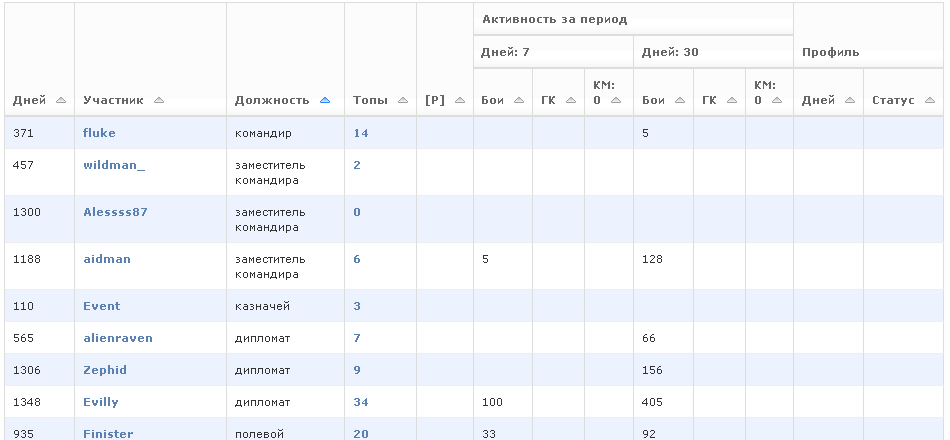

Current activity of clan's members
==================================

Table for the whole clan include data about total number of battles and battles in ClanWars for each member for two periods (last 7 and 30 days). 
This data begin to accumulate with the addition of the clan. They are fully valid after 7 and 30 days respectively. 

In the "status" column displays a short text message from a clan member. This message the player can enter in the appropriate filed on his profile page.
Apart from the general table of clan members, the status is also displayed in the tables of participants in the control section of the tank companies.

Also, there are a pages with individual detailed information for every clan member.

.. figure:: activity_period_01.png
   :alt: Member activity for a period

Above the calendar cards with information about the player battles by day there's a link "History". 
Clicking on it, you can see the history of the fighting by days, starting with the addition to the site.

Premium mode of servicing allow detailed information (by the types of tanks) about current activity (week, month) of the clan members,
detailed figures of battles for each day on certain tanks, history of battles at a certain tank.

.. figure:: activity_period_02.png
   :alt: Member activity for a period by tanks

.. figure:: activity_prem_01.png
   :alt: Member activity for a period by tanks

.. figure:: activity_prem_02.png
   :alt: Member activity for a period by tanks
