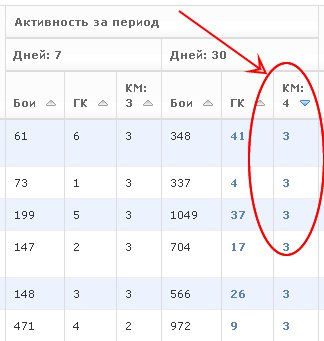

Attendance at events
====================

With this function, you can control the attendance of clan events (trainings, companies, CW, 7/42, strongholds).

Table of a clan members in the columns "CA" shows the number of events in which the player participated during the relevant period.
Sorting the list of participants by this column, you can detect the participants taking an active part in the life of the clan, and participants who ignore the clan events.

In the data section of the player in the "Attendance" displays a history of participation of the player into clan events, with received positive and negative evaluations.

.. figure:: attendance_account.jpg
   :alt: Minutes of participation of the player into clan events

In the clans section in the "Attendance" displays a table of activity commanders with data on how many activities commander led.
If in the report about the event you stated the number of battles and victories, then the winrates will be calculated.

All these data are taken from reports about events, that are created in this section.
The event can consist of a single battle or a series of battles (for example, a tournament for the landing).
Each event must have a single commander.

Creating a report on the event will take a minimum of time.
Simply upload the .wotreplay file, check the position of commander into automatically generated list (or the player who carried out the training), and then click "Save."

In addition, if necessary, you can edit the list (add / remove members), set up the positive or negative remark to participant and upload additional .wotreplay files.

.. figure:: attendance_edit.jpg
   :alt: Event report

If you upload replays to the "Attendance" module, for these replays there are pages with advanced statistic and protocol of combat chat.
To visit this page, you can click to link with the date in table of .wotreplay files at the report page.

Page with advanced statistics contains lists of commands with the following data for each participant:

* experience points
* frags
* damaged and spotted enemyies
* damage dealt
* damage assisted radio
* shots
* direct hits
* piercings
* explosion hits
* potential damage received
* mileage

Board member of the clan (leader/vice-leader or position from a custom list) must approve the report by clicking the appropriate button. After that, the data from the report will be added into overall statistics of a clan.

.. figure:: attendance_approve.jpg
   :alt: The list of reports for approval
