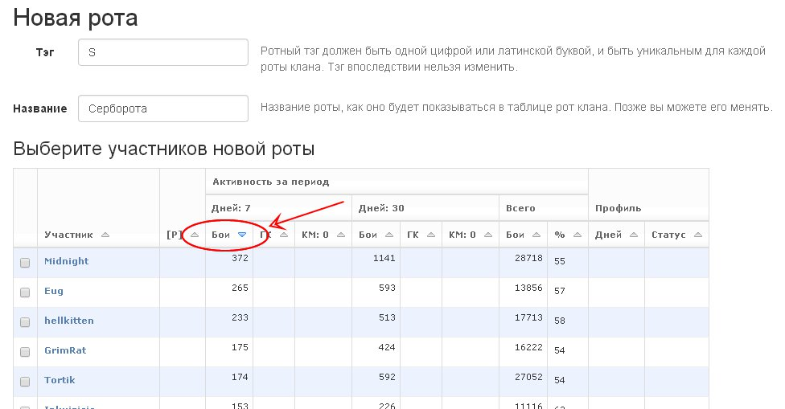
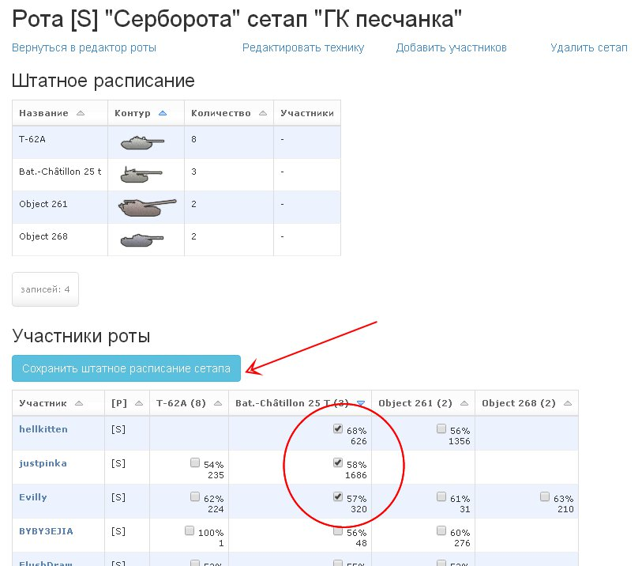
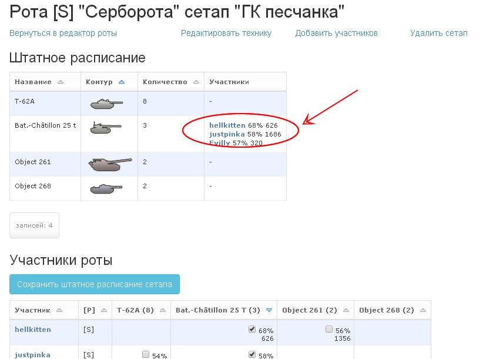
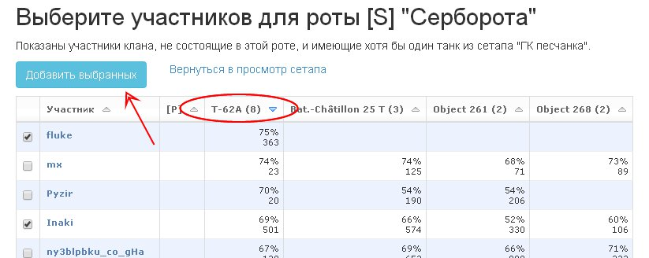

Example of usage the clan's company function
============================================

Let's say you're a field commander SerB of the WG clan and you've been assigned a task to create an effective company to fight in CW. 
The first goal is to land on GM on the map "Sand river".

.. figure:: start.jpg
   :alt: Click the 'New company' link.

Authorize on the site, switch to the WG clan page and open "Management". Click the "New company" link.

You see plenty of nicknames, but you don't know who well they all play. 
That's why you decide to select accounts with maximum battles executed for the last week. 
You don't need combatants with 10 battles a week in your company, do you?

Sort the table of the clan members by "Activity for period", "Days: 7", "Battles" in the descending order by clicking the title of that column. 
You should select first 14 players in the left column, then locate and select yourself. 
Then you specify a tag and a company title in the corresponding fields and click the "Form a company" button below.

.. note::
   Member activity data begin accumulating since the moment the clan was added to the website. 
   If you just added your clan to the website, the activity data will not be available.

   Complete data on player activity for last 7 and 30 days will be available after a week and a month respectively starting from the moment the clan was added. 
   Besides, it also matters how regularly you update the data of your clan, if a free mode of service is used.

   In this example, the WG clan is serviced since 2012 and data are automatically renewed daily. 
   So you have full and reliable information on activity of members during the given period.*

.. figure:: setup_new.jpg
   :alt: New setup

Now switch to the company editor. You should decide what vehicles your new company will play.

Suppose, you decided to use the following setup for the task: two arty "Object 261", 3 "Bat. Chattillons", 2 tank destroyers "Object 268", 8 T-62A. 
Click the "New setup" link.

.. figure:: setup_edit.jpg
   :alt: Edit setup's vehicles

Open the list of X level vehicles and select tanks we need with checkmarks. 
Specify the desired number in the boxes that appears next to tanks. 
Name the setup and click the "Save" button at the bottom of the page.

Now open the company setup edit page. 
Here you can see what machines company members have and their skill level on those vehicles (win rate and the number of executed battles).

You should decide which players will run which vehicle. 
Let's start with batchats. Sort the table by win rate on batchats by clicking the "Bat.-Chatillon 25 T" column title.
So we set batchat as a default tank for hellkitten, justpinka and Evilly players. 
Click the "Save members roles in setup" button.

Players we selected appear in the "Stuff list" table below the "Company members" table.

Repeat these steps for the rest vehicles in your setup. Eventually, you'll have the following results.

.. figure:: roles_edit.jpg
   :alt: Edit members roles in stuff list

The company is up to strength with artys, batchats and 268, but we still miss two T-62A.

At the same time players GrimRat and Sorell either do not have the corresponding machines or have too low skills for your victorious company.

.. figure:: members_add.jpg
   :alt: Add members to company

You must find players for two MTs. Click the "Add members" link.

The opened table lists all clan members that aren't part of your company yet and do have at least one tank from your current setup. 
Sort the table by the "T-62A" column by clicking the title of this column.

Players having the highest win rate in this list played too little battles on this vehicle, so we select the players fluke and Inaki. 
They has enough battles of this machine and his win rate is also acceptable. 
Click the "Add selected" button.

On the setup edit page find the new company members and assign "T-62A" as a default tank to him by putting the checkmark in the corresponding cell 
and clicking the "Save members roles in setup" button.

.. figure:: members_edit.jpg
   :alt: Edit members list

Now you should expel all scrubs spoiling your victorious company without mercy. Click the "Back to company edit" link.

.. figure:: members_remove.jpg
   :alt: Remove members from company

Select all combatants you don't need in the left column, select "Remove from company" and click the "Execute" button.

.. figure:: company_show.jpg
   :alt: View company

Switch to the public section "Companies", find our company, 
click it and below the member table find the table of company setups, 
click the "CW sand river" line and see our glorious setup.

.. figure:: setup_show.jpg
   :alt: View setup of the company

Publish the link to this page on clan's forum to notify members that they are enrolled to the new company 
and informs them on which tanks they should prepare for CW battles by purchasing premium consumables and ammunition.

The task assigned by clan command is accomplished.

.. attention::
   Tags of clans, player nicknames and their skill levels used in the above example are fictional. Any resemblances are coincidental.
