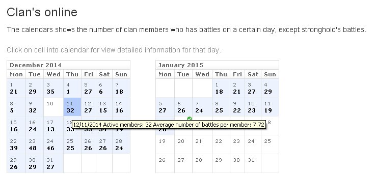
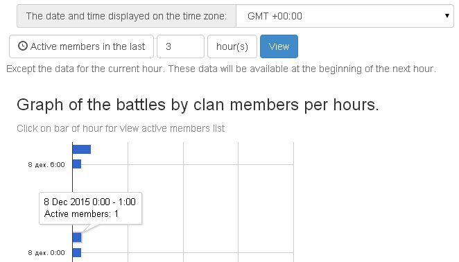
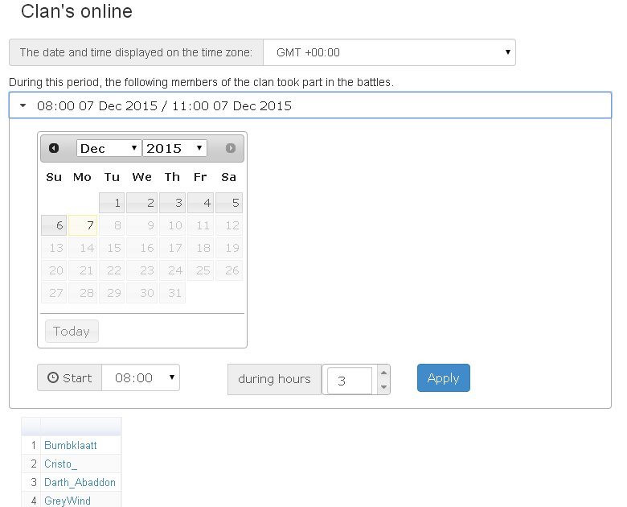
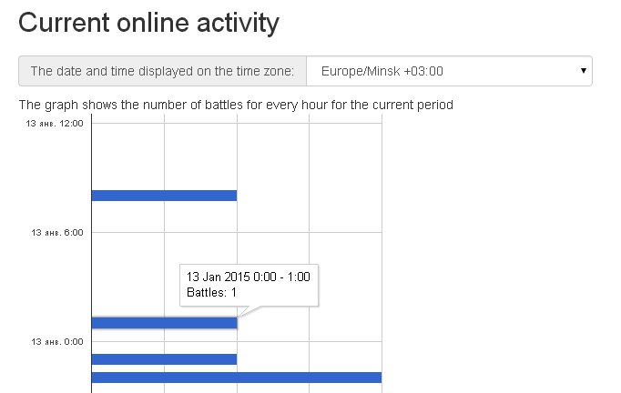

Clan's online statistic
=======================

For clans using paid plans ("Base" or "Premium"), a summary of the clan's daily activity is available in the "Online" tab. 
The cell for each day on the calendar shows each clan member who has had at least one battle that day. 
If you hover over the cell for a certain day, a tooltip will appear showing the clan members' average number of battles for that day.

If your clan uses free plan, you can try this function for free by turning on the "Base" service mode for thirty days. 
To do this, the clan-leader or vice-leader needs to login on the clan panel site with their Wargaming OpenID and click "Free Trial" on the clan page. 
If the clan has already used a trial period, this feature is unavailable.

For clans using "Premium" plan, online information about the clan's hourly online activity and "Active members in the last N hours" widget are also available in the "Online" tab.

For each hour of the current and previous day, this chart shows the number of clan members who have had battles in this hour. 
The chart is updated at the beginning of every hour.

A similar graph can be seen for any day in the past, starting from the moment the clan starts using "Premium" mode. 
For this, click on the chosen day on the calendar in the "Online" tab.

If you click on the hour column in the chart, you can see the list of players, who have had battles during that hour. 
When viewing the results of a query, you can select any interval in hours (the size of interval cannot exceed 24 hours) for any day.
On this day, the clan must have an active premium plan into clan-panel.

Player's names in that list are links through which you can view an hourly chart of the chosen player's battles for that day.
The chart's bars represent the number of the player's battles for each hour.

Additionally, a similar chart for the present and previous days is available in the "Online" tab of the data section of the player's account.
