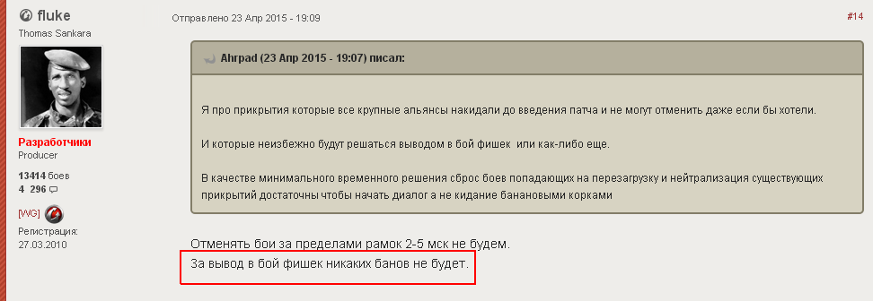

FAQ
===

Why has clan [XXX] been in my tasks for two days in a row?
----------------------------------------------------------

If you put a cover on any of the days, the second day will disappear from this clan's tasks - that is, 
will be filtered out by the rule "there are attacks planned for this clan". 
This will be happens when the data about attack will appear at wargaming.net and will be readed by clan-panel.
For all other clans, the second (uncovered) day will stay in their tasks.

Is it possible for some clan not to be covered? That is, nobody will put a cover on it.
---------------------------------------------------------------------------------------

This scenario is only possible in case there will be no technical possibility to cover this clan. 
There can be only two real reasons for that: few alliance members or tool many clans in one defense hour.

If somebody has the technical capability to throw a cover, it will be on their task lists. 
An uncovered clan will see who can provide cover by clicking on an uncovered day in their schedule.

I followed a link sent by an alliance member and got this message "The clan administration allowed this page to be viewed only by clan members." What should I do?
------------------------------------------------------------------------------------------------------------------------------------------------------------------

The link you have is probably to the clan section of the person who gave you the link. 
This is like trying to click a link to something in a private area on the WG portal. No one, except the owner, has access to it.

You need to go to YOUR clan's section. There is a special procedure for it, which will work for everyone.

* Go to the site clan-panel
* Click the "Sign in" button at the top of the page
* Go to the "Stronghold" tab
* Click the green button labelled "Tasks for clan" (available to clan officers)

After authorization in the clan panel, I don't see the green "Clan tasks" button on the "Stronghold" tab, although I am the vice-leader in the clan. Why?
---------------------------------------------------------------------------------------------------------------------------------------------------------

It often happens if your clan data in the clan panel are obsolete and no longer correspond to your current position in the clan.

Please pay attention to the value of the "Data updated:" field next to the clan emblem. 
Clan composition and member status changes are saved after each update. 
If the latest update took place relatively recently, click the "Update data" button in the upper part of the page. 
The clan data will be updated within a day and the "Clan tasks" button on the "Stronghold" tab will be available to you on the next day.

In the future, do not forget to periodically click the "Update data" button to keep your clan details up-to-date.

In addition, you can ask someone from the leadership of the clan, who currently has access, go to the "Management" tab 
and click "Update list of participants and their positions" button.
In this case, the clan panel update the composition of the clan immediately, without the collection of data for statistics.

Can we get banned for these covers if they consider them rigged battles?
------------------------------------------------------------------------

First of all, provision of cover does not fall under the definition of a "rigged battle":

   Let's start from the definition: rigged battles are battles that are specifically organized for achieving abnormally high statistical results and winning rare rewards.

.. figure:: wg_msg01.png
   :alt: ru portal link

Also, the developers have given a direct answer to this question.

   There will be no bans for throwing chips into battle.

